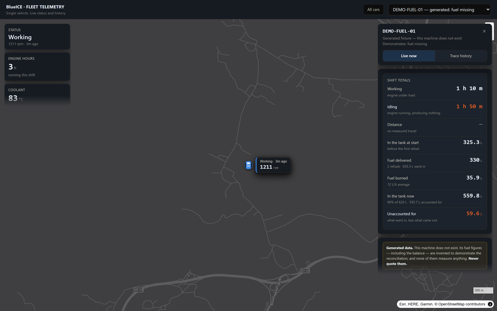
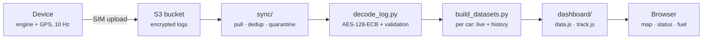
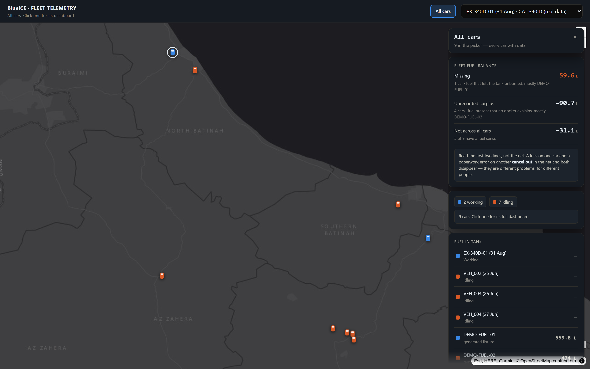
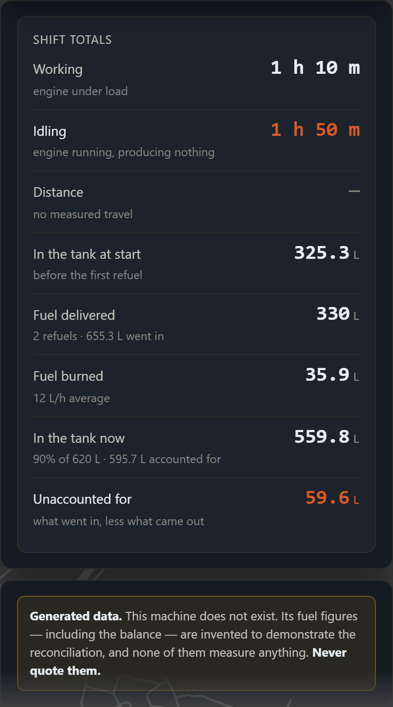
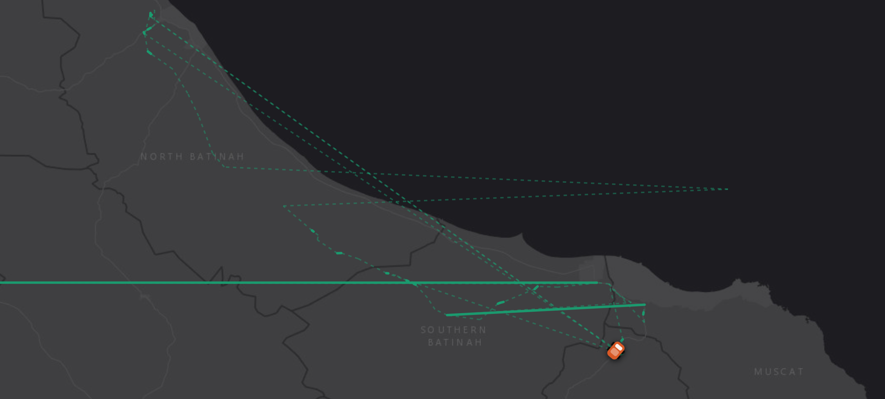

# Fleet Telemetry — reverse engineering an undocumented logger

Internship project, summer 2026. A construction company had GPS/engine loggers
fitted to its machines, uploading encrypted files to S3 every few minutes — and
**no documentation of the format, no decoder, and no way to read any of it.**

This is the decoder, the specification, the dashboard built on top, and the
analysis that came out of it.



---

## Start here

The write-up is longer than the code. This table is the map — pick by what you
want, not by filename.

| If you want… | Read | Length |
|---|---|---|
| **How the format was cracked** | [FORMAT_SPEC.md](FORMAT_SPEC.md) | Complete byte-level spec |
| **The investigation, and the finding** | [BUG_REPORT.md](BUG_REPORT.md) | The best thing here |
| **What the data actually says** | [FINDINGS.md](FINDINGS.md) | Every figure, with its source |
| **Why it is built this way** | [DECISIONS.md](DECISIONS.md) | Each decision and its reasoning |
| **The whole story, start to finish** | [REPORT.md](REPORT.md) | Long-form |
| **Just to run it** | [Quick start](#quick-start) below | Three commands |

**Short on time?** [BUG_REPORT.md](BUG_REPORT.md) — it is where the
engineering actually shows.

---

## What was actually hard

**The format was undocumented.** Binary files with an `AES2` magic number and no
specification. Working out the framing, the cipher mode and the 23-byte record
layout was the first stretch of the project.

The cipher mode gave itself away: counting repeated 16-byte ciphertext blocks
found **one appearing 470 times** in the first 4,000 frames. Under any chaining
mode that is vanishingly unlikely — so it was ECB, and ECB made the rest
tractable.

```
000000  41 45 53 32  30 00 7A 4B   AES20.zK     ← AES2 magic
000036  20 00  07 0C A5 A5 3B 33    .....;3     ← 0x0020 = 32-byte payload
000058  20 00  D9 B9 AA 10 8C BD    .......     ← 34 bytes later
00007A  20 00  6B 0E D0 96 62 84    .k...b.     ← and again
```

**Then the data turned out to be mostly corrupt.** Once it decoded, only a
fraction of records held physically possible values. Not a decoder bug: the
framing arithmetic closes exactly, and surviving records decode perfectly.

**And the corruption was not what it first looked like.** Measured on one shift
it appeared to be a flat 99.5% loss. Decoding all 27 logs across seven months
showed something far more useful:

| Day | Format | Valid records | Valid % |
|---|---|---:|---:|
| 2026-06-16 | JSON-lines | 32,832 / 32,832 | **100.00%** |
| 2026-06-24 | JSON-lines | 61,080 / 61,080 | **100.00%** |
| 2026-07-07 | binary | 73,885 / 123,369 | 59.89% |
| 2026-07-15 | binary | 252 / 123,435 | 0.20% |
| 2026-07-16 | binary | 130 / 123,435 | **0.11%** |

There is a step change around 2026-07-09 after which it never recovers, and log
length does not explain it: two logs of ~123,400 records differ by 300×.

**A correction, which is the more interesting part.** An earlier version of
this README argued that the 100% logs ruled out the AES key, the record layout,
the framing and the decoder — because the same firmware had written perfect
files.

That reasoning does not hold, and it is withdrawn. Every 100% log is
**JSON-lines**: plaintext, self-describing, decoded with no key, no struct and
no framing. It exercises a different code path entirely. Worse, the two formats
never overlap in time — the last JSON log is 2026-06-27, the first binary one
2026-06-29 — so "binary" and "after 28 June" are perfectly confounded, and no
binary log has ever decoded above 59.89%.

A systematic defect in the binary decoder is therefore *not* excluded by this
corpus. What can still be shown, and what would settle it, is set out in
[BUG_REPORT.md](BUG_REPORT.md).

---

## How it fits together



Every stage is re-runnable and idempotent. The ingest keys on ETag + SHA-256,
so the same file arriving twice costs nothing and can never be double-counted,
and a file that fails validation is **quarantined rather than discarded** —
something you threw away cannot be re-examined once you understand the problem
better.

---

## Quick start

Needs **Python 3.8+**. The only hard dependency is `pycryptodome`, for the
AES-128-ECB decode:

```bash
pip install -r requirements.txt
```

The decryption key is **not in this repository** and has no default. Supply it
through the environment — `BLUEICE_LOG_KEY` locally, or `BLUEICE_KEY_SECRET`
naming an AWS Secrets Manager secret in a deployment. The synthetic fleet below
needs no key.

No real telemetry ships with this repository. The synthetic fleet exercises
every feature, including the fuel reconciliation:

```bash
python make_fuel_demo.py
```

```bash
python dashboard/build_datasets.py demo/*.txt
```

```bash
python dashboard/serve.py --port 8765
```

Then open <http://localhost:8765>. You should see five demonstration machines,
each showing a different fuel case — one clean, one with fuel missing, one with
an unlogged delivery.

---

## What got built

**A decoder** — [`decode_log.py`](decode_log.py). Two log formats (binary and
JSON-lines), per-record physical validation, and a release gate so "is the
firmware fixed?" is a command rather than an opinion.

**An ingest pipeline** — [`sync/`](sync/). Polls S3, decodes, deduplicates
across files, quarantines rather than discards. Self-test covers the merge
arithmetic.

**A dashboard** — [`dashboard/`](dashboard/). MapLibre, one HTML file, no build
step, no framework.

**Fuel reconciliation** — [`fuel_reconcile.py`](fuel_reconcile.py). Three
independent instruments — tank level, in-line burn meter, bowser flow meter:

```
unaccounted = (level_start + dispensed) − (level_end + burned)
```

Positive means fuel left the tank unburned. Negative means fuel arrived that no
docket explains. They are reported as two separate lines and **never netted**,
because a theft on one machine and a paperwork error on another would cancel
out and both would disappear.

**AWS deployment** — [`aws/`](aws/). Lambda on a 5-minute schedule, S3 +
CloudFront. Most runs compare ETags and exit in about a second; a full rebuild
is ~34 s. Deployed and running; see [Status](#status).

| | |
|---|---|
|  |  |

---

## The idea the project is built around

**Never let the interface claim more than the data supports.**

- A dash `—` means *not measured*. It never means zero.
- Distance counts only stretches the device actually watched. Gaps over an hour
  are drawn as nothing at all — a straight line between two fixes days apart is
  fiction, and on the first multi-log build it invented 6,747 km of travel for
  an excavator that had not moved.
- Below 95% record validity the totals panel shows percentage shares and
  refuses to show hours. Extrapolating 14 hours from 2% coverage is a guess
  wearing a number's clothes.
- Generated demonstration data is badged as generated on every screen.



*Solid = recorded continuously. Dashed = two known points and a guess between
them. Only the solid line is counted as distance.*

---

## Status

| | |
|---|---|
| Format specification | Complete, verified against 2.06M records |
| Decoder + validation gate | Working |
| Ingest pipeline | Working, self-tested |
| Dashboard | Working |
| Fuel reconciliation | Working, demonstrated on synthetic data — no machine has a fuel sensor fitted yet |
| AWS deployment | **Deployed and running.** Lambda rebuilds the dashboard every 5 minutes |
| Firmware defect | **Still present.** Not something this repository can fix |

---

## What I would do differently

- **Measure the spread before believing a single sample.** The 0.50% figure was
  correct and completely misleading. Everything interesting came from asking
  whether one shift generalised — that question should have come first, not
  after the tooling was built.
- **`track.js` is one 8.6 MB file for the whole fleet.** It gzips to 0.78 MB so
  it works, but the dashboard loads every machine's history to show one. Per-car
  files would have been the right call from the start.
- **The decoder and the validator grew together.** They should have been
  separable from the beginning, so the validation rules could be tested without
  a real log to hand.

---

## A note on the data

Every figure here was measured, not estimated, and figures that could not be
measured are marked as such. The company's real telemetry, its firmware and its
asset register are **not** in this repository. Operational identifiers are
placeholders. See [LICENSE](LICENSE) for what is and is not covered.
